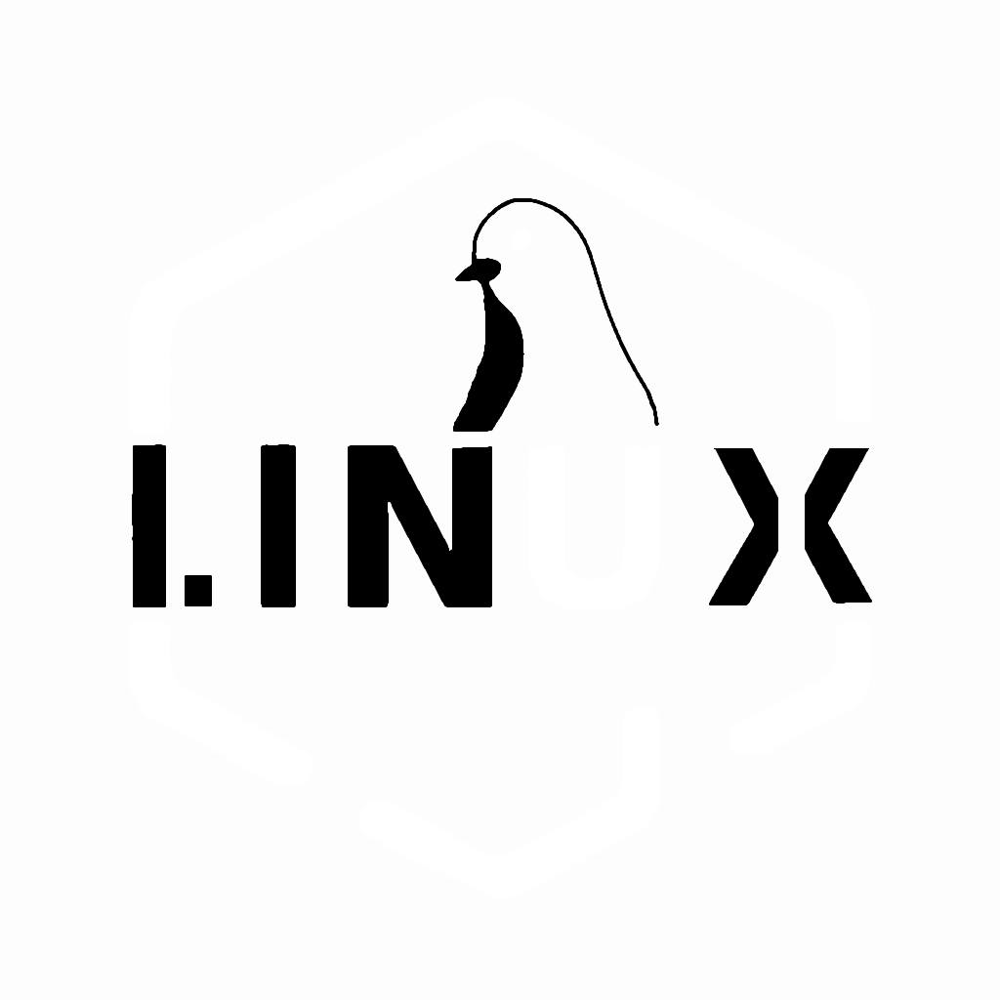

# Linux-Logo
Updated the Linux "logo" with some slogans.

if any of you mention that "Um actually it's GNU/LINUX" I am telling you I ain't starting that debate, Linux sounds better so we just say Linux.
One of the biggest issue of FREE OPEN software is that they often have crabby branding, since their focus is not on selling your their "products".
[ LINUX: LINUX Is Not UniX ]
(The only OS where freedom is recursive.)
I've created this logo and slogan to represent the Linux operating  system, and I want to share it with the community.  The open license ensures  that the work remains freely available and can be shared and built upon  by others. So feel free to use it in your own projects, and please give credit where credit is due. Together, we can help spread the word about  Linux and the power of open source!

Also I know that the first vesion of the logo does look like IINUX and not LINUX, It was a design choice, I taught it Looked cooler, but since a lot of people found it weird or confusing, I made the newer version,

Feel free to use that other open project of mine to convert these image into wallpaper: https://github.com/AmosNimos/wallmake

Note that you can change the HUE (colors) of any of these logo with the following convert command from ImageMagic, it will pick a random hue for the image (make sure to replace "input_image.png" with the actual target image name.):

~~~
convert input_image.png -modulate 100,100,$((RANDOM%100)) output_image.png
~~~

Also It would be very nice if somoene had the time to convert the logo into vector art.

## The Logo:
[bnwa.png](bnwa.png)
[gba.png](gba.png)
[linux10.png](linux10.png)
[linux2.png](linux2.png)
[linux3.png](linux3.png)
[linux4.png](linux4.png)
[linux5.png](linux5.png)
[linux6.png](linux6.png)
[linux7.png](linux7.png)
[linux8.png](linux8.png)
[linux9.png](linux9.png)

[ynwa.png](ynwa.png)
